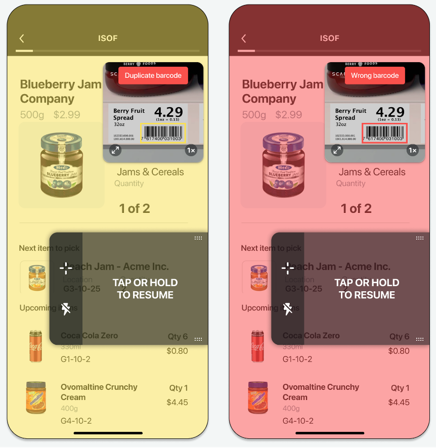
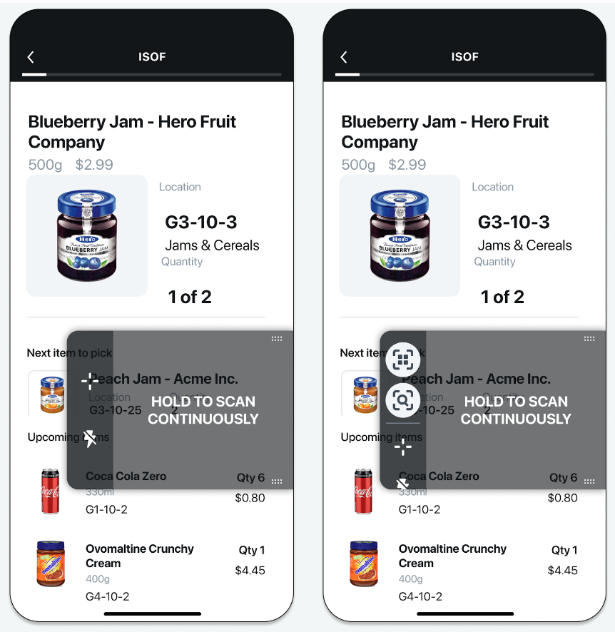

# Advanced Configurations

SparkScan is optimized by default for efficiency, accuracy, and a seamless user experience. However, there are some cases where you might want to customize the behavior of SparkScan. This guide will show you how to add additional capabilities and further customize SparkScan to best fit your needs.

## Advanced Capabilities

### Hardware Button Control

Allowing the end user to control the scanner with hardware buttons can be useful if your users typically wear gloves. It can also improve ergonomics in some workflows.

SparkScan offers a built-in API to let you do this via [`SDCSparkScanViewSettings.hardwareTriggerEnabled`](https://docs.scandit.com/data-capture-sdk/ios/barcode-capture/api/ui/spark-scan-view-settings.html#property-scandit.datacapture.barcode.spark.ui.SparkScanViewSettings.HardwareTriggerEnabled).

### Trigger Error State

You may want to introduce logic in your app to show an error message when scanning specific barcodes (e.g. barcodes already added to the list, barcodes from the wrong lot etc.). SparkScan offers a built-in error state you can easily set to trigger an error feedback prompt to the user.

You can customize:

* The text message.
* The timeout of the error message. The scanner will be paused for the specified amount of time, but the user can quickly restart the scanning process by tapping the trigger button.
* The color of the flashing screen upon scan. You can enable or disable the visual feedback via [`SDCSparkScanViewSettings.visualFeedbackEnabled`](https://docs.scandit.com/data-capture-sdk/ios/barcode-capture/api/ui/spark-scan-view-settings.html#property-scandit.datacapture.barcode.spark.ui.SparkScanViewSettings.VisualFeedbackEnabled) and you can control the color via [`SDCSparkScanViewFeedback`](https://docs.scandit.com/data-capture-sdk/ios/barcode-capture/api/ui/spark-scan-view-feedback.html#class-scandit.datacapture.barcode.spark.ui.SparkScanViewFeedback).
* The color of the highlight for the scanned barcode.
* The feedback (sound, vibration).

To emit an error, you have to implement a [SDCSparkScanFeedbackDelegate](https://docs.scandit.com/data-capture-sdk/ios/barcode-capture/api/spark-scan-feedback-delegate.html#interface-scandit.datacapture.barcode.spark.feedback.ISparkScanFeedbackDelegate) and set it to the [SparkScanView](https://docs.scandit.com/data-capture-sdk/ios/barcode-capture/api/ui/spark-scan-view.html#class-scandit.datacapture.barcode.spark.ui.SparkScanView):

```swift
sparkScanView.feedbackDelegate  = self
```

In the [SDCSparkScanFeedbackDelegate.feedbackForBarcode](https://docs.scandit.com/data-capture-sdk/ios/barcode-capture/api/spark-scan-feedback-delegate.html#method-scandit.datacapture.barcode.spark.feedback.ISparkScanFeedbackDelegate.GetFeedbackForBarcode) you can then return an error or a success feedback:

```swift
extension ViewController: SparkScanFeedbackDelegate {
  func feedback(for barcode: Barcode) -> SparkScanBarcodeFeedback? {
      guard !barcode.isRejected else {
          return SparkScanBarcodeErrorFeedback(message: "This code should not have been scanned",
              resumeCapturingDelay: 60)
      }
      return SparkScanBarcodeSuccessFeedback()
  }
}
```

:::note
You can have different error states triggered by different logic conditions. For example you can trigger an error state when a wrong barcode is scanned, and another one when a duplicate barcode is scanned. These errors can show different colors and have different timeouts.
:::


A high timeout (e.g. `10`+ seconds) typically requires the users to interact with the UI to start scanning again. This is a good choice when you want to interrupt the scanning workflow, for example when a wrong barcode is scanned and some actions need to be performed.

A small timeout could allow the user to scan again without having to interact with the app, just momentarily pausing the workflow to acknowledge that a “special” barcode has been scanned. If timeout is set to 0 workflow is not paused at all.

### Reject Barcodes

To prevent scanning unwanted barcodes (like those already listed or from incorrect lots), use SparkScan’s built-in error state. Setting the [SDCSparkScanBarcodeErrorFeedback.resumeCapturingDelay](https://docs.scandit.com/data-capture-sdk/ios/barcode-capture/api/ui/spark-scan-barcode-feedback.html#property-scandit.datacapture.barcode.spark.feedback.Error.ResumeCapturingDelay) parameter to `0` allows the user to continue scanning immediately without pausing on rejected codes.

### Add Advanced Scanning Modes to the Setting Toolbar

SparkScan is our best solution for high-speed single scanning and scan-intensive workflows. Depending on your use case, you can use SparkScan in conjunction with other Scandit advanced scanning modes, such as MatrixScan Find or MatrixScan Count, to speed up your workflows.

SparkScan offers pre-build buttons you can add to the setting toolbar to easily move to different scan modes from within the SparkScan UI.

First you will need to show these buttons:

```swift
// Show the MatrixScan Count and MatrixScan Find buttons
sparkScanView.isBarcodeCountButtonVisible = true
sparkScanView.isBarcodeFindButtonVisible = true
```



In addition you have to add a listener to the [`SDCSparkScanView`](https://docs.scandit.com/data-capture-sdk/ios/barcode-capture/api/ui/spark-scan-view.html#class-scandit.datacapture.barcode.spark.ui.SparkScanView) via [`SDCSparkScanView.UIDelegate`](https://docs.scandit.com/data-capture-sdk/ios/barcode-capture/api/ui/spark-scan-view.html#property-scandit.datacapture.barcode.spark.ui.SparkScanView.UiListener). You will then receive callbacks when the **Barcode Find** button or **Barcode Count** button is tapped from the toolbar.

```swift
self.sparkScanView.UIDelegate = self

//...

func barcodeCountButtonTappedInView(_ sparkScanView: SparkScanView) {

}

func barcodeFindButtonTappedInView(_ sparkScanView: SparkScanView) {

}
```

## Customization

### Customize Color and Text

All text, colors and opacity of the SparkScan UI elements (trigger button, setting toolbar, toasts) can be customized to match the desired language and color scheme.

Please refer to [SDCSparkScanView](https://docs.scandit.com/data-capture-sdk/ios/barcode-capture/api/ui/spark-scan-view.html#class-scandit.datacapture.barcode.spark.ui.SparkScanView) for the full list of parameters.

### Add Controls to the Setting Toolbar

The Settings Toolbar is hidden by default in SparkScan, as the most relevant controls are already visible in the camera preview.
However, additional advanced controls can be made available, such as:

* Target Mode
* Continuous Mode

By enabling the visibility of these buttons, the Settings Toolbar will appear at the bottom of the camera preview.

Please refer to [SDCSparkScanView](https://docs.scandit.com/data-capture-sdk/ios/barcode-capture/api/ui/spark-scan-view.html#class-scandit.datacapture.barcode.spark.ui.SparkScanView) for the full list of parameters.
