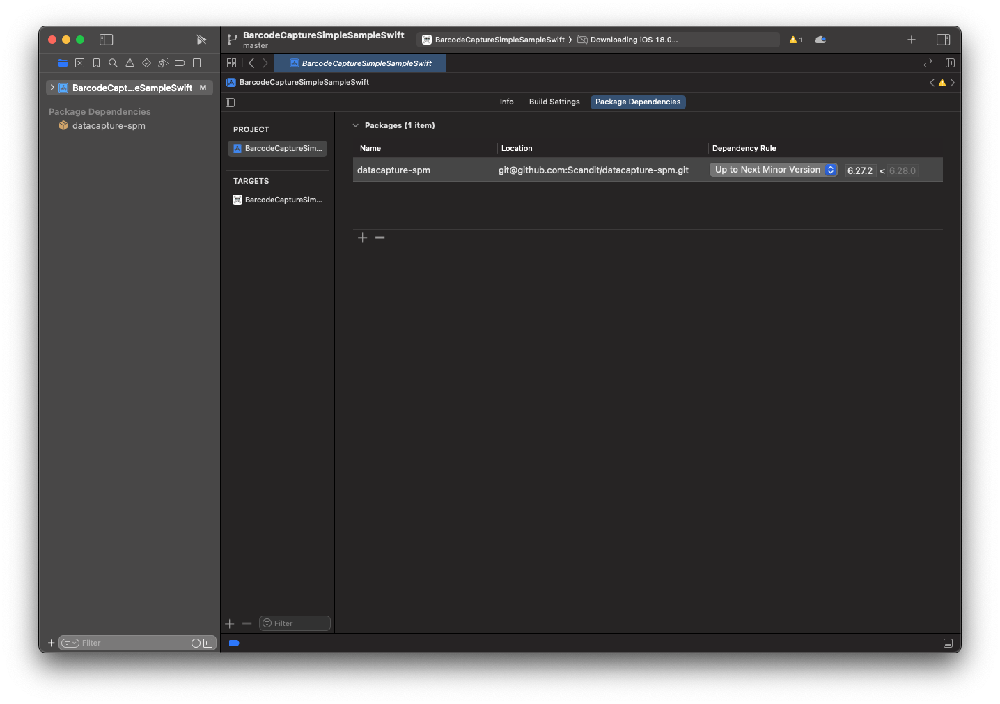
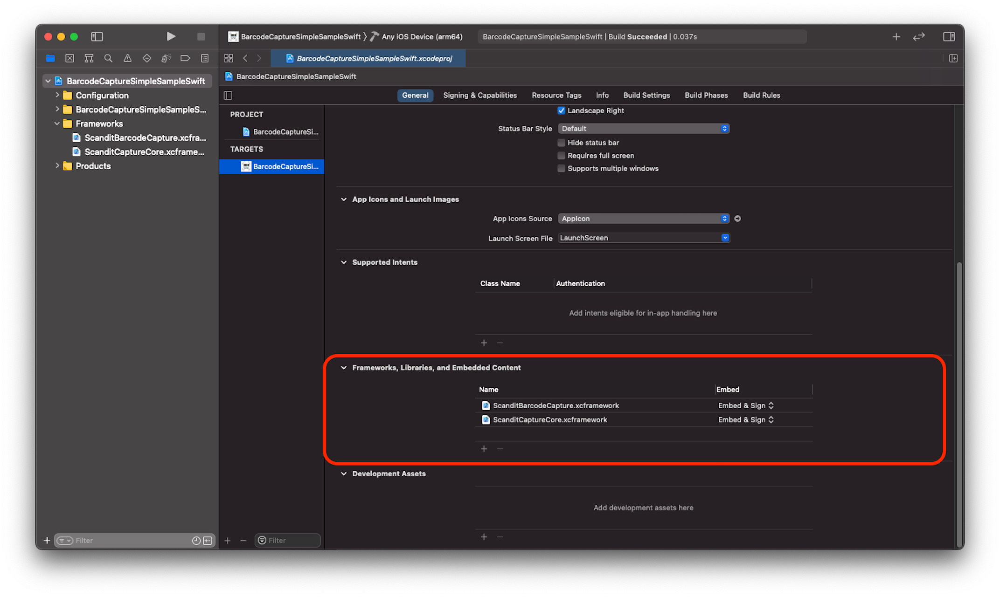

# Installation

This page describes how to integrate the Scandit Data Capture SDK into your iOS project. The SDK can be added via:

- [CocoaPods](#install-via-package-manager)
- [Carthage](#install-via-package-manager)
- [Swift Package Manager](#install-via-package-manager)
- [Import in Source Code](#import-in-source-code)

## Prerequisites

Before you begin, make sure you have the following prerequisites in place:

- Latest version of Xcode
- iOS project with a deployment target of iOS 14.0+
- Scandit license key, sign up for a [free trial](https://www.scandit.com/trial/) if you don't already have a license key

### Internal Dependencies

import InternalDependencies from '../../partials/get-started/_internal-deps.mdx';

<InternalDependencies/>

## Install via Package Manager

<Tabs groupId="managers">

<TabItem value="cocoaPods" label="CocoaPods">

[CocoaPods](https://cocoapods.org/) is a dependency manager for Swift and Objective-C Cocoa projects. To integrate the Scandit Data Capture SDK into your Xcode project using CocoaPods, specify the required pods for your use case, detailed above in [Internal Dependencies](#internal-dependencies), in your `Podfile`:

```ruby
pod 'ScanditCaptureCore',
# Add the necessary pods based on the features needed for your use case
```

</TabItem>

<TabItem value="carthage" label="Carthage">

[Carthage](https://github.com/Carthage/Carthage) is a decentralized dependency manager that builds your dependencies and provides you with binary frameworks.

To integrate the Scandit Data Capture SDK into your Xcode project using Carthage, specify it in your `Cartfile`:

```ruby
binary "https://ssl.scandit.com/sdk/download/carthage/ScanditCaptureCore.json"
```

You also need to add the corresponding binaries based on the features you need as detailed above in [Internal Dependencies](#internal-dependencies).

For example, if you want to add the [`ScanditBarcodeCapture`](https://docs.scandit.com/data-capture-sdk/ios/barcode-capture/api.html) API, you need to add the following Carthage binary:

```ruby
binary "https://ssl.scandit.com/sdk/download/carthage/ScanditBarcodeCapture.json"
```

</TabItem>

<TabItem value="spm" label="Swift Package Manager">

To integrate the Scandit Data Capture SDK into your Xcode project using Swift Package Manager, add the frameworks you want to add in the _Package Dependencies_ section of your project.



Add our SPM package repository:

```shell
https://github.com/Scandit/datacapture-spm
```

Or if you prefer checking out git repositories via SSH:

```shell
git@github.com:Scandit/datacapture-spm.git
```

You also need to add the corresponding frameworks based on the features you need as detailed in [Internal Dependencies](#internal-dependencies).
</TabItem>

</Tabs>

## Add the Frameworks Manually

Adding the frameworks manually is a single step process when using the XCFramework archives.

All you need to do is drag the frameworks into the _Frameworks, Libraries, and Embedded Content_ section of your target. Make sure to select _Embed and Sign_ for the _Embed_ option.

Please note that you will always need at least `ScanditCaptureCore.xcframework` which contains the shared functionality used by the other data capture modules.



:::note
When building the project, by default Xcode will look for the frameworks in the root folder of the project.

If you choose to copy the frameworks in a different location, don’t forget to update the `FRAMEWORK_SEARCH_PATHS` build setting accordingly.
:::

## Import in Source Code

To import the Scandit Data Capture SDK into your source code, add the following import statement:

<Tabs>
<TabItem value="swift" label="Swift">

```swift
import ScanditCaptureCore
import ScanditBarcodeCapture
import ScanditLabelCapture
import ScanditIdCapture
import ScanditParser
```

</TabItem>
<TabItem value="objectivec" label="Objective-C">

```objectivec
@import ScanditCaptureCore;
@import ScanditBarcodeCapture;
@import ScanditLabelCapture;
@import ScanditIdCapture;
@import ScanditParser;
```

</TabItem>
</Tabs>

## Additional Information

import OSSLicense from '../../partials/_third-party-licenses.mdx';

<OSSLicense/>